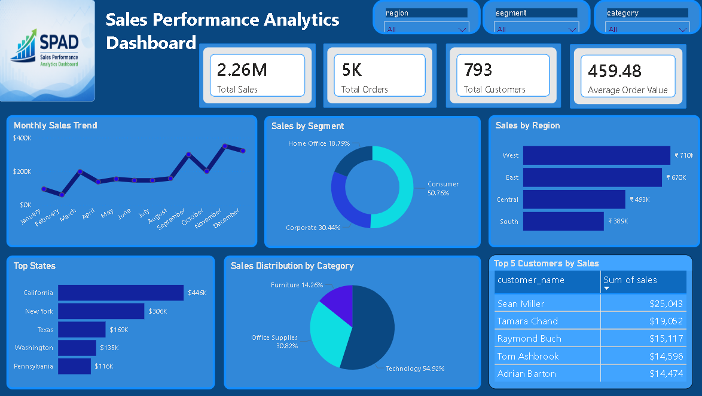
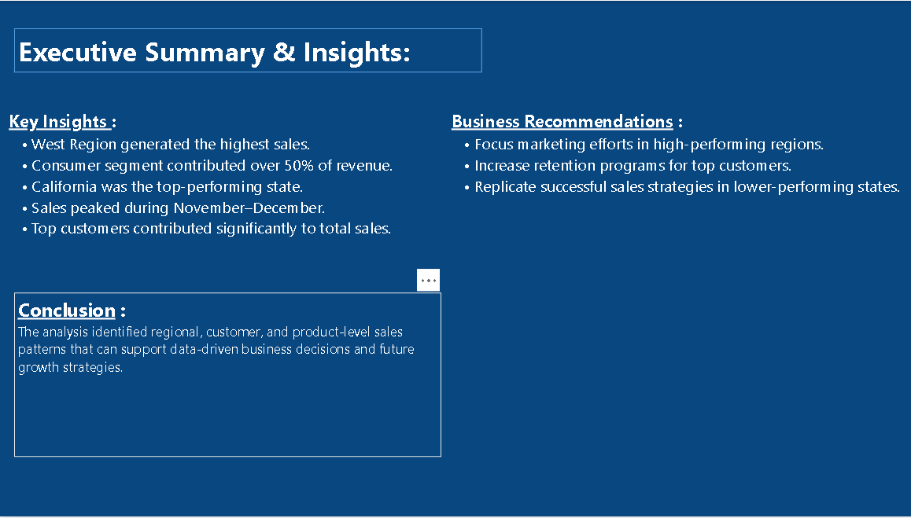

# Sales Performance Analytics Dashboard

## Project Overview

The Sales Performance Analytics Dashboard is an end-to-end Business Intelligence project designed to analyze sales performance across regions, states, customer segments, and product categories.

This project demonstrates the complete data analytics workflow, including data cleaning, SQL-based analysis, KPI development, dashboard creation, and business insight generation. The objective was to transform raw sales data into meaningful business intelligence that supports data-driven decision-making.

---

## Project Objectives

- Analyze overall sales performance.
- Identify top-performing regions and states.
- Understand customer segment contribution to revenue.
- Monitor monthly sales trends.
- Evaluate product category performance.
- Develop an interactive dashboard for business reporting.

---

## Business Problem Statement

Organizations generate large volumes of sales data every day. However, raw transactional data alone does not provide actionable insights for decision-makers.

The business required an interactive analytics dashboard capable of:

- Monitoring sales performance.
- Identifying high-performing regions.
- Understanding customer behavior.
- Tracking sales trends.
- Supporting strategic business decisions.

---

## Dataset Information

The dataset contains transactional sales records with the following fields:

| Category | Attributes |
|-----------|-----------|
| Order Information | Order ID, Order Date |
| Customer Information | Customer Name, Customer Segment |
| Geographic Information | State, Region |
| Product Information | Product Category, Product Details |
| Sales Metrics | Sales Revenue |

---

## Tools & Technologies Used

| Tool | Purpose |
|--------|---------|
| Excel | Data Cleaning & Validation |
| PostgreSQL | Data Analysis & KPI Calculation |
| SQL | Business Analysis & Aggregations |
| Power BI | Dashboard Development & Visualization |

---

## Project Workflow / Methodology

### Step 1: Data Cleaning (Excel)

- Missing value inspection
- Data validation
- Date verification
- Consistency checks

### Step 2: SQL Analysis (PostgreSQL)

Business analysis performed:

- Total Sales Analysis
- Sales by Region
- Sales by State
- Customer Segment Analysis
- Monthly Sales Trend Analysis
- Product Category Analysis

### Step 3: Dashboard Development (Power BI)

Created an interactive dashboard featuring:

- KPI Cards
- Sales Trend Analysis
- Regional Performance Analysis
- Customer Segment Analysis
- Category Performance Analysis
- Executive Summary Reporting

---

## Data Cleaning & Preprocessing

The dataset was cleaned and validated before analysis.

| Activity | Description |
|-----------|-------------|
| Data Validation | Verified data accuracy |
| Missing Value Inspection | Checked for incomplete records |
| Date Verification | Validated date formats |
| Consistency Checks | Ensured data consistency |
| Data Preparation | Structured dataset for analysis |

---

## Exploratory Data Analysis (EDA)

The following analyses were conducted:

- Overall Sales Performance
- Regional Sales Distribution
- State-Level Performance Analysis
- Customer Segment Analysis
- Monthly Sales Trend Analysis
- Product Category Analysis
- Top Customer Revenue Analysis

---

## Key Visualizations

### Dashboard Overview



### Business Insights



### Visualizations Included

- Monthly Sales Trend
- Sales by Region
- Sales by Segment
- Top States by Sales
- Category Analysis
- Top Customers by Sales

---

## Key Findings

| Finding | Business Impact |
|----------|----------------|
| West Region generated the highest sales revenue | Indicates strong regional market performance |
| Consumer Segment contributed more than 50% of total sales revenue | Highlights the most valuable customer segment |
| California emerged as the highest-performing state | Identifies a key revenue-driving market |
| Sales peaked during November and December | Reveals strong seasonal demand trends |
| A small group of customers contributed significantly to revenue | Highlights customer retention opportunities |

---

## Business Insights

### Regional Performance

The West Region consistently outperformed other regions, making it the highest revenue contributor.

### Customer Segment Analysis

The Consumer Segment generated more than half of total sales revenue, making it the primary driver of business growth.

### Geographic Performance

California emerged as the highest-performing state, demonstrating strong market demand and customer engagement.

### Seasonal Trends

Sales activity increased significantly during November and December, indicating strong year-end demand.

### Customer Contribution

A relatively small group of customers generated a substantial portion of total revenue, emphasizing the importance of customer retention strategies.

---

## Business Recommendations

- Increase investment in high-performing regions.
- Strengthen customer retention programs.
- Leverage seasonal demand trends for marketing campaigns.
- Replicate successful sales strategies in lower-performing states.
- Develop targeted campaigns for high-value customer segments.

---

## Key Metrics

| KPI |
|------|
| Total Sales |
| Total Orders |
| Total Customers |
| Average Order Value |
| Monthly Sales Trend |
| Sales by Region |
| Sales by Segment |
| Category Performance |

---

## Skills Demonstrated

### Technical Skills

- Excel
- PostgreSQL
- SQL
- Power BI
- Data Cleaning
- Dashboard Development
- Data Visualization

### Analytical Skills

- KPI Development
- Trend Analysis
- Business Intelligence
- Data Storytelling
- Reporting
- Insight Generation

---

## Project Structure

```text
Project-1-Sales-Analytics
│
├── README.md
│
├── data_set
│   └── train.csv
│
├── documentation
│   └── sales-performance-doc.pdf
│
├── excel_cleaning
│   └── sales_data.csv
│
├── powerbi_dashboard
│   └── Sales_Dashboard.pbix
│
├── screenshots
│   ├── dashboard.png
│   └── insights.png
│
└── sql_analysis
    ├── analysis_queries.sql
    └── create_table.sql
```

---

## Conclusion

The Sales Performance Analytics Dashboard successfully transformed raw transactional data into actionable business insights through data cleaning, SQL analysis, and interactive dashboard development.

The project demonstrates practical experience in Business Intelligence, Data Visualization, SQL Analysis, KPI Development, and Data Storytelling while providing meaningful insights to support data-driven decision-making.

---

## Author

### Santhoshi Mishra

**Aspiring Data Analyst  | SQL | Power BI | Excel**

GitHub: https://github.com/santhoshimishra

LinkedIn: https://www.linkedin.com/in/santhoshimishra
